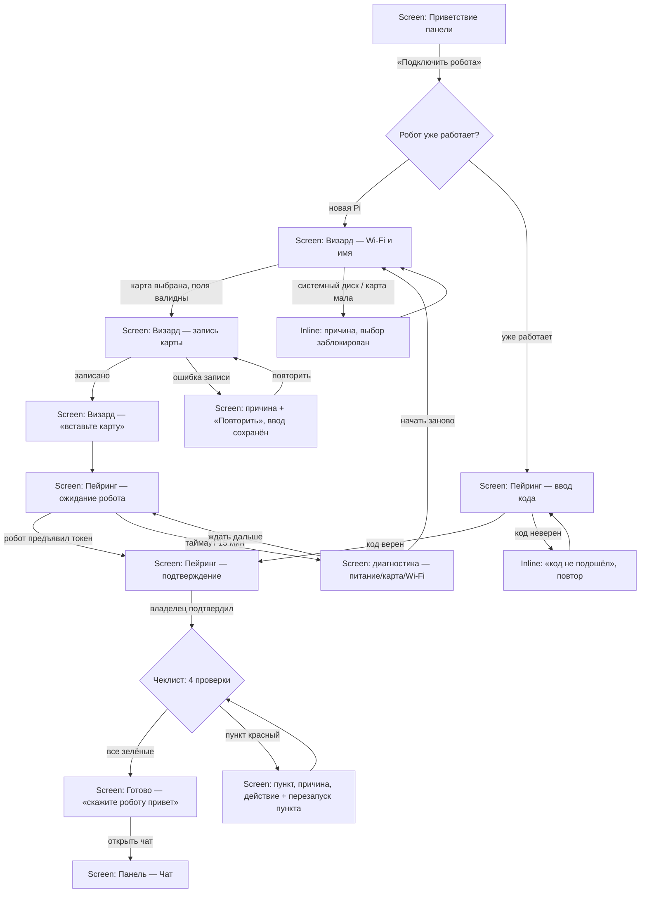
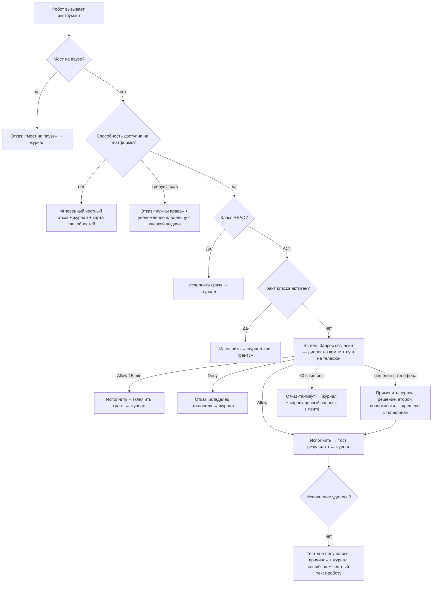
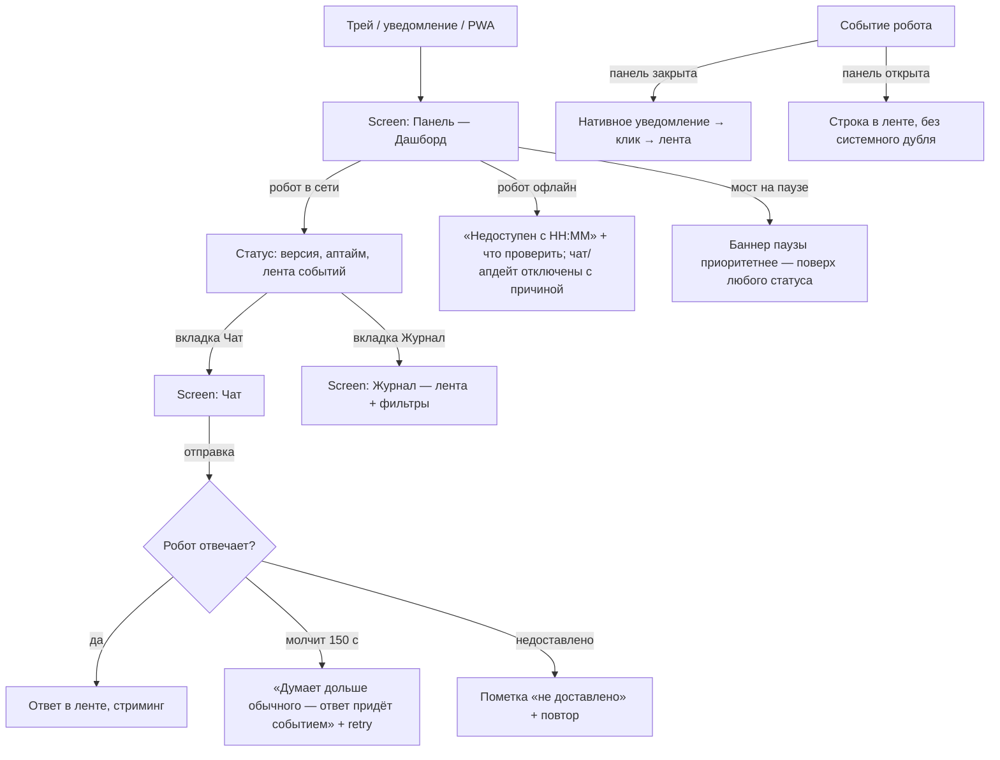
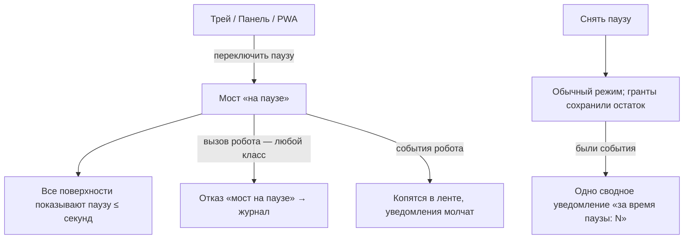
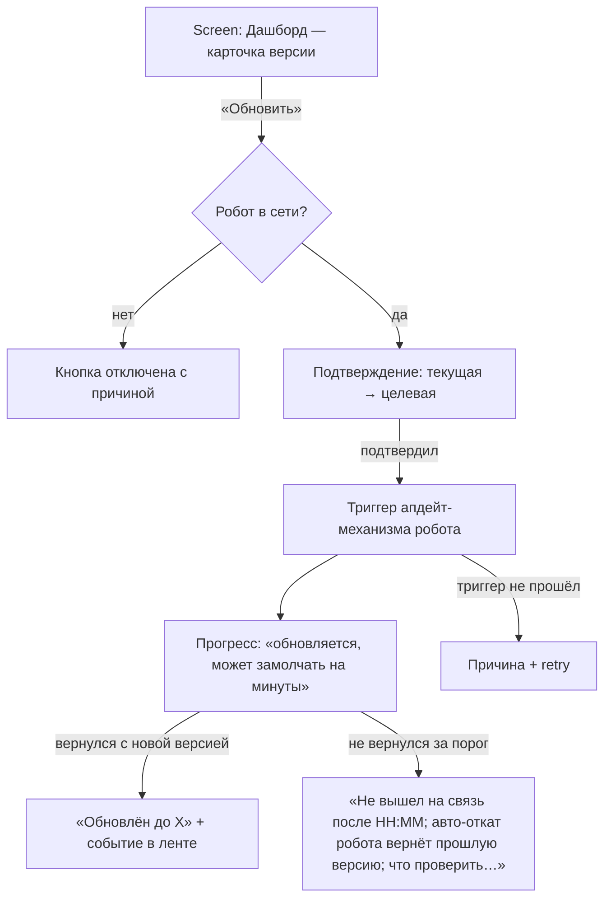

<!-- Managed with super-ux (ux-contract v4). The HOW layer: task analysis and user flows scenarios trace to. -->

# vibe-bridge — Flows

### FLW-01: Подключение робота
- **Traces:** ST-007, ST-008, ST-011 (JTBD-03, JRN-02/#2–6)
- **Goal:** владелец видит зелёный чеклист связки и открытый чат с роботом
- **Entry points:** первый запуск bridge (панель-приветствие); панель → «Подключить робота»
- **Success exit:** чеклист «найден → связан → проверен → согласие работает» зелёный; CTA «открыть чат»
- **Task analysis:**
  1. Понять путь (объяснение: карта → робот сам ставится → связка)
  2. Выбрать носитель и ввести Wi-Fi + имя робота
  3. Записать карту (права администратора — с объяснением)
  4. Физический шаг: вставить карту, включить питание
  5. Дождаться робота (живой прогресс, диагностика по таймауту)
  6. Подтвердить связку и увидеть проверку фактами
- **Rejected shape:** «страница с командами для копирования в терминал» (как у
  большинства DIY-роботов) — отвергнута: противоречит JTBD-03 и vision §4
  (владелец — не оператор терминала); теряет P-02 на первом же шаге.
  Второй кандидат — «всё делает официальный Raspberry Pi Imager, мы даём
  инструкцию» — отвергнут: разрыв на полпути, токен пейринга не положить,
  ошибка невидима для визарда.
- **Flow:**

- **Screens traversed:**
  | Screen | States used here |
  |--------|------------------|
  | SCR-02 Панель · Дашборд | empty (не спарен) |
  | SCR-06 Визард подключения | intro, sd-select, wifi-form, writing, insert-card, error |
  | SCR-07 Пейринг | waiting, found, confirm, checklist, green, diagnostic, code-entry |
  | SCR-03 Панель · Чат | empty |

### FLW-02: Согласие на действие
- **Traces:** ST-001, ST-002 (JTBD-01, JRN-03)
- **Goal:** каждое ACT-действие исполнено ровно после решения владельца — либо честно отклонено
- **Entry points:** робот вызывает ACT-инструмент; робот вызывает недоступную способность (деградация)
- **Success exit:** действие исполнено/отклонено; запись в журнале; робот получил честный текст
- **Task analysis:**
  1. Увидеть, что просит робот (человеческая строка)
  2. Решить: Allow / Allow 15 min / Deny — там, где владелец сейчас
  3. Увидеть результат (тост/журнал)
- **Rejected shape:** «очередь запросов с батч-подтверждением» — отвергнута:
  согласие пакетом = согласие вслепую (vision, принцип 1); один запрос —
  одно решение. Вторая — «подтверждение в чате робота текстом» — отвергнута:
  решение должно быть кнопкой с таймером, а не свободным текстом, который
  мозг интерпретирует.
- **Flow:**

- **Screens traversed:**
  | Screen | States used here |
  |--------|------------------|
  | SCR-05 Запрос согласия | desktop-dialog, phone-page, resolved-elsewhere, expired |
  | SCR-01 Трей | grant-active |
  | SCR-04 Панель · Журнал | success |
  | SCR-08 Панель · Настройки | capability-map (для C_tcc/C_err) |

### FLW-03: Пульт — статус, чат, события, журнал
- **Traces:** ST-004, ST-005, ST-006, ST-010, ST-012 (JTBD-02, JRN-01)
- **Goal:** владелец за один взгляд понимает состояние робота и может говорить с ним
- **Entry points:** клик по трею; клик по уведомлению события; PWA с телефона
- **Success exit:** вопрос владельца закрыт (статус увиден / сообщение отвечено / журнал прочитан)
- **Task analysis:**
  1. Открыть панель из трея (или PWA)
  2. Считать статус и ленту
  3. При необходимости — написать роботу / открыть журнал
- **Rejected shape:** «дашборд с графиками метрик (CPU, память, температура)» —
  отвергнут: это мониторинг для инженера, не пульт для владельца (vision §4);
  метрики живут у робота, паналь отвечает на «жив? что делал? что просил?».
- **Flow:**

- **Screens traversed:**
  | Screen | States used here |
  |--------|------------------|
  | SCR-01 Трей | active, paused, robot-offline |
  | SCR-02 Панель · Дашборд | loading, success, robot-offline, paused |
  | SCR-03 Панель · Чат | empty, thinking, success, undelivered, disabled |
  | SCR-04 Панель · Журнал | empty, loading, success, filtered |
  | SCR-09 PWA-оболочка | online, offline-no-vpn, offline-bridge-down |

### FLW-04: Пауза
- **Traces:** ST-003 (JTBD-04, JRN-03/#4)
- **Goal:** сомнение владельца снято одним действием; робот видит «выключенное устройство»
- **Entry points:** трей; панель; PWA
- **Success exit:** мост «на паузе», состояние видно на всех поверхностях
- **Task analysis:** одно действие — переключатель; одно состояние — видно везде
- **Rejected shape:** «пауза по классам инструментов (READ работает, ACT нет)» —
  отвергнута: полу-пауза разрушает ментальную модель «как выключенный ноутбук»
  (vision, принцип 3); тонкая настройка — это карта способностей, не пауза.
- **Flow:**

- **Screens traversed:**
  | Screen | States used here |
  |--------|------------------|
  | SCR-01 Трей | active, paused |
  | SCR-02 Панель · Дашборд | paused |
  | SCR-09 PWA-оболочка | online |

### FLW-05: Обновление робота
- **Traces:** ST-009 (JTBD-03, JRN-02/#7)
- **Goal:** робот обновлён его собственным механизмом; владелец видел прогресс и результат
- **Entry points:** дашборд, карточка версии
- **Success exit:** «обновлён до X» + событие в ленте
- **Task analysis:** увидеть версию → подтвердить → ждать с честным прогрессом → увидеть результат
- **Rejected shape:** «bridge сам заливает файлы на робота» — отвергнута:
  дублирует и ломает blind-update-канон робота (GitHub-only, авто-rollback
  R1.51); bridge триггерит и наблюдает, но не деплоит.
- **Flow:**

- **Screens traversed:**
  | Screen | States used here |
  |--------|------------------|
  | SCR-02 Панель · Дашборд | success, loading, robot-offline |
